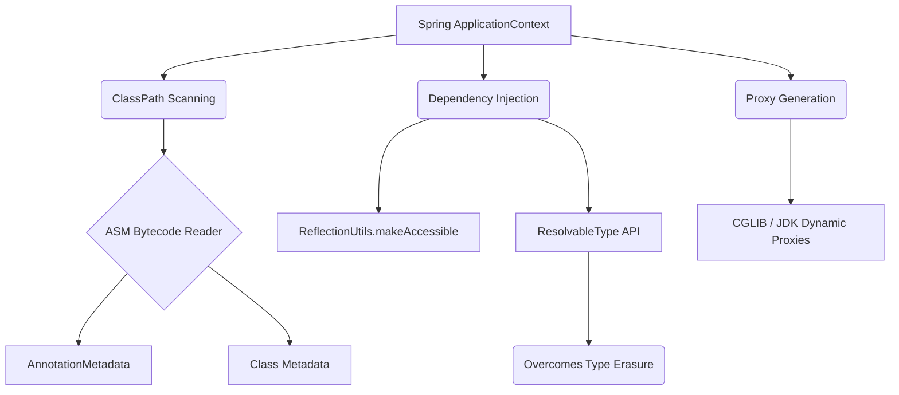

# Chapter 010: Core Java for Spring — Reflection, Annotations, Generics, Functional Interfaces, Records

## 1. Concept

Spring Boot is often perceived as "magic" by engineers transitioning from other languages or standard Java libraries. This perceived magic—automatic dependency injection, declarative transactions, proxy-based interceptors, and transparent data mapping—is fundamentally powered by standard Core Java features, intelligently applied at scale. To master Spring in a production environment, one must understand the underlying mechanical foundation: Reflection, Annotations, Generics, Functional Interfaces, and Records.

**Reflection** is the ability of a Java program to inspect and manipulate its own structure at runtime. It allows Spring to discover classes, invoke constructors, instantiate beans, read fields, and execute methods without having explicit compile-time knowledge of them. While powerful, reflection circumvents standard access controls (allowing manipulation of `private` members) and incurs a performance penalty because the JVM cannot apply the same aggressive Just-In-Time (JIT) optimizations to dynamically invoked code.

**Annotations** (`@interface`) provide a mechanism to attach metadata to Java constructs (classes, methods, fields, parameters) without altering their execution semantics. They solve the "XML configuration hell" problem that plagued early Spring versions. By embedding configuration metadata directly alongside the code, developers can declare intentions—such as "this method requires a transaction" or "this class is an injectable service"—which Spring's runtime infrastructure reads and acts upon.

**Generics**, introduced in Java 5, provide compile-time type safety. However, they are implemented using *type erasure*, meaning generic type parameters are discarded at runtime to maintain backward compatibility with older Java versions. This presents a massive challenge for a framework like Spring, which needs to know the exact types at runtime to correctly auto-wire dependencies (e.g., distinguishing between `List<String>` and `List<User>`) or route events to appropriately typed handlers. Spring solves this through sophisticated workarounds that recover retained generic signatures from class hierarchies.

**Functional Interfaces** (interfaces with a single abstract method, or SAM) and lambdas, introduced in Java 8, enable behavioral parameterization. Spring leverages these heavily for callbacks, lazy initialization, and configuration DSLs. They solve the boilerplate problem associated with anonymous inner classes, allowing for fluent APIs and deferred execution patterns essential for resilient system design.

**Records**, stabilized in Java 16, are transparent, immutable carriers for data. They automatically generate constructors, accessors, `equals()`, `hashCode()`, and `toString()` methods based on their state description. In the context of Spring, they solve the verbosity of Data Transfer Objects (DTOs) and configuration property bindings, replacing external code generation tools like Lombok for immutable data carriers.

Understanding these features is not an academic exercise; it is an absolute operational necessity. When a Spring application fails in production—whether due to an `@Autowired` injection failure, an AOP interceptor not firing, or a massive GC pause—the root cause almost always traces back to a misunderstanding of how these core Java mechanisms operate under the hood.

## 2. Internal Working

To debug Spring internals effectively, one must understand how Spring utilizes these Java features internally. 

### Reflection: The Engine of the BeanFactory
Spring's `ApplicationContext` is essentially an advanced reflection engine. During startup, the `ClassPathBeanDefinitionScanner` loads classes using `Class.forName()`. It then utilizes `Constructor.newInstance()` to instantiate objects. To populate `@Autowired` fields, Spring bypasses standard setter methods and directly manipulates the memory layout using `Field.set()`, often calling `field.setAccessible(true)` to modify private dependencies. 

Because standard reflection API usage is verbose and exception-heavy, Spring abstracts it via the `ReflectionUtils` class. However, reflection is notoriously slow. Every call to `Method.invoke()` involves argument array packing, unwrapping, and dynamic dispatch. In modern Spring, optimizations like `MethodHandle` (introduced in Java 7) and CGLIB/ByteBuddy code generation are used to generate fast-path proxies, minimizing the raw reflection tax on the hot path.

### Annotations: Metadata Processing
Spring does not rely entirely on the standard Java reflection API to read annotations. Standard `Class.getAnnotations()` loads the target classes into the JVM, which can be computationally expensive during component scanning if a class ultimately isn't a Spring bean. Instead, Spring uses `ASM` (a bytecode manipulation framework) via `SimpleMetadataReader` and `AnnotationMetadata`. This allows Spring to read `.class` files directly from the disk/JAR, inspect the annotations, and build `BeanDefinition` objects without ever loading the class into the `ClassLoader`.

Furthermore, Spring supports *meta-annotations* (annotations on annotations). For example, `@RestController` is meta-annotated with `@Controller` and `@ResponseBody`. Standard Java does not support annotation inheritance, but Spring's `MergedAnnotations` API recursively traverses annotation hierarchies, allowing developers to create highly composable custom annotations. Spring requires these annotations to have `@Retention(RetentionPolicy.RUNTIME)`; otherwise, they are discarded by the compiler or JVM before Spring can read them.

### Generics: Overcoming Type Erasure with ResolvableType
Consider the declaration `@Autowired private List<PaymentStrategy> strategies;`. Because of type erasure, the JVM runtime sees this merely as `List`. How does Spring know to inject only beans implementing `PaymentStrategy` and not `String`? 

While standard generic type variables are erased, Java *does* retain generic type information in class and field signatures (accessible via `Field.getGenericType()` or `Class.getGenericSuperclass()`). Spring wraps Java's cumbersome `ParameterizedType`, `GenericArrayType`, and `TypeVariable` APIs into a powerful utility called `ResolvableType`. 

`ResolvableType` navigates the class hierarchy to resolve type variables. If you implement `class StripePaymentStrategy implements PaymentStrategy<StripePayload>`, Spring uses `ResolvableType.forClass(StripePaymentStrategy.class).as(PaymentStrategy.class).getGeneric(0).resolve()` to determine that the generic payload is `StripePayload`. This mechanism is the backbone of Spring's `ApplicationEventPublisher`, generic `Repository<T, ID>` interfaces, and typed dependency injection.

### Functional Interfaces: Deferred Execution and Callbacks
Spring internally uses functional interfaces to defer execution and handle resource management safely. `TransactionTemplate.execute(TransactionCallback<T>)` ensures the transaction is opened before the callback executes and committed/rolled back afterward. `ObjectProvider<T>` allows for lazy bean resolution, preventing circular dependencies or heavy object initialization until absolutely necessary. Similarly, `Supplier<T>` is heavily used in Spring's programmatic bean registration API (`GenericApplicationContext.registerBean(Class, Supplier)`), enabling reflection-free, lightning-fast bean instantiation.

### Records: Jackson and DTOs
Spring MVC and Spring WebFlux integrate seamlessly with Java Records via Jackson. When Jackson encounters a record, it detects the canonical constructor and the component accessors automatically. No default no-argument constructor is required, and no `@JsonCreator` annotations are necessary (unless customizing the mapping). This makes Records the optimal choice for API request/response objects. However, Records cannot be used as JPA `@Entity` classes. Hibernate requires entity classes to have a no-argument constructor (for reflection-based instantiation before field population) and requires fields to be mutable (to support lazy-loading proxies), both of which violate the fundamental design of Java Records.



## 3. Enterprise Scenario

**Context:** The FinFlow Payment Platform orchestrates financial transactions between a highly trafficked API Gateway and a third-party Stripe-like processor. According to the architecture baseline (`ARCHITECTURE.md`), the Payment Service handles approximately 50,000 active users, bursting to 4,000 requests per second (rps) at peak load. It runs across 20 horizontally scaled instances, constrained by a strict HikariCP connection pool limit of 10 connections per instance.

The Payment Service engineering team is tasked with implementing a critical compliance and architectural overhaul:

1.  **PCI-DSS Compliance Audit Logging:** Every sensitive operation (e.g., capturing a payment, issuing a refund) must be strictly audited. The team decides to build a custom `@Auditable` annotation. An AOP aspect will intercept methods bearing this annotation and log the action to an append-only audit table via a Kafka topic.
2.  **Domain Event Routing:** To decouple the synchronous payment flow from downstream ledger updates, the system utilizes domain events. The team implements a `TypeAwareEventRouter` that receives an abstract `DomainEvent` and dynamically dispatches it to the correct `DomainEventHandler<T extends DomainEvent>` implementation.
3.  **Modernizing DTOs:** To reduce technical debt and memory overhead, the team is migrating all API response objects from mutable POJOs to Java Records, beginning with the `PaymentResponse`.

Given the 4,000 rps peak and strict 200 total database connection limit across the cluster, the performance overhead of the AOP interceptors and event routers must be heavily optimized. Any inefficiency in reflection or type resolution will amplify into catastrophic GC pressure or connection pool exhaustion.

## 4. Incorrect Implementation

The following code was deployed by the engineering team. It contains three critical, highly realistic bugs related to core Java features.

### Bug 1: The `@Auditable` Annotation (Wrong Retention)
The team created the annotation but failed to specify the correct retention policy. By default, Java annotations default to `RetentionPolicy.CLASS`, or the developer explicitly sets it to `CLASS` thinking it is more efficient.

```java
package com.finflow.chapter010.audit;

import java.lang.annotation.ElementType;
import java.lang.annotation.Retention;
import java.lang.annotation.RetentionPolicy;
import java.lang.annotation.Target;

// BUG 1: CLASS retention makes this annotation invisible to reflection at runtime.
@Retention(RetentionPolicy.CLASS)
@Target(ElementType.METHOD)
public @interface Auditable {
    String action();
    String resourceType();
}
```

### Bug 3: The Audit Aspect (Uncached Reflection)
The aspect executes on every payment call. It attempts to read the method parameters and the annotation details dynamically.

```java
package com.finflow.chapter010.audit;

import org.aspectj.lang.ProceedingJoinPoint;
import org.aspectj.lang.annotation.Around;
import org.aspectj.lang.annotation.Aspect;
import org.aspectj.lang.reflect.MethodSignature;
import org.springframework.stereotype.Component;

import java.lang.reflect.Method;
import java.util.Arrays;
import java.util.logging.Logger;

@Aspect
@Component
public class AuditAspect {
    private static final Logger log = Logger.getLogger(AuditAspect.class.getName());

    @Around("@annotation(com.finflow.chapter010.audit.Auditable)")
    public Object auditMethod(ProceedingJoinPoint joinPoint) throws Throwable {
        MethodSignature signature = (MethodSignature) joinPoint.getSignature();
        Method method = signature.getMethod();
        
        // BUG 3: Uncached reflection in a hot path. 
        // getAnnotation() and getParameterTypes() create defensive copies and proxies on every single invocation.
        Auditable auditable = method.getAnnotation(Auditable.class);
        
        if (auditable == null) {
            log.fine("Auditable annotation not found on method: " + method.getName());
            return joinPoint.proceed();
        }

        long start = System.currentTimeMillis();
        try {
            return joinPoint.proceed();
        } finally {
            long duration = System.currentTimeMillis() - start;
            Class<?>[] paramTypes = method.getParameterTypes(); // More uncached reflection allocation
            
            // In a real system, this sends an event to Kafka. Here we log.
            log.info(String.format("AUDIT: Action=%s, Resource=%s, Params=%s, DurationMs=%d",
                    auditable.action(), auditable.resourceType(), Arrays.toString(paramTypes), duration));
        }
    }
}
```

### Bug 2: The Naive Event Router (Type Erasure Ignorance)
The team built a router to dynamically dispatch events to handlers. They attempt to resolve the generic type `T` using the standard `Class.getTypeParameters()` reflection API.

```java
package com.finflow.chapter010.events;

import org.springframework.stereotype.Component;
import java.lang.reflect.TypeVariable;
import java.util.List;
import java.util.Map;
import java.util.concurrent.ConcurrentHashMap;
import java.util.logging.Logger;

public interface DomainEvent {}

public record PaymentCompletedEvent(String transactionId, double amount) implements DomainEvent {}
public record RefundIssuedEvent(String transactionId, double amount) implements DomainEvent {}

public interface DomainEventHandler<T extends DomainEvent> {
    void handle(T event);
}

@Component
public class PaymentCompletedHandler implements DomainEventHandler<PaymentCompletedEvent> {
    private static final Logger log = Logger.getLogger(PaymentCompletedHandler.class.getName());
    @Override
    public void handle(PaymentCompletedEvent event) {
        log.info("Processing payment completion for txn: " + event.transactionId());
    }
}

@Component
public class EventRouter {
    private static final Logger log = Logger.getLogger(EventRouter.class.getName());
    private final Map<Class<?>, DomainEventHandler<?>> registry = new ConcurrentHashMap<>();

    public EventRouter(List<DomainEventHandler<? extends DomainEvent>> handlers) {
        for (DomainEventHandler<?> handler : handlers) {
            // BUG 2: getTypeParameters() returns TypeVariables (representing the letter 'T'), 
            // NOT the actual resolved generic class (e.g., PaymentCompletedEvent.class) due to Type Erasure.
            TypeVariable<?>[] typeParameters = handler.getClass().getTypeParameters();
            
            if (typeParameters.length > 0) {
                // This resolves to the bounding type or Object, causing massive mapping corruption.
                Class<?> eventType = (Class<?>) typeParameters[0].getBounds()[0];
                registry.put(eventType, handler);
                log.info("Registered handler for event type: " + eventType.getSimpleName());
            }
        }
    }

    @SuppressWarnings("unchecked")
    public <T extends DomainEvent> void route(T event) {
        DomainEventHandler<T> handler = (DomainEventHandler<T>) registry.get(event.getClass());
        if (handler != null) {
            handler.handle(event);
        } else {
            log.warning("No handler found for event type: " + event.getClass().getSimpleName());
        }
    }
}
```

### The Service Class
```java
package com.finflow.chapter010.service;

import com.finflow.chapter010.audit.Auditable;
import com.finflow.chapter010.events.EventRouter;
import com.finflow.chapter010.events.PaymentCompletedEvent;
import org.springframework.stereotype.Service;

public record PaymentResponse(String status, String transactionId) {}

@Service
public class PaymentService {
    private final EventRouter eventRouter;

    public PaymentService(EventRouter eventRouter) {
        this.eventRouter = eventRouter;
    }

    @Auditable(action = "CAPTURE_PAYMENT", resourceType = "PAYMENT_TRANSACTION")
    public PaymentResponse processPayment(String orderId, double amount) {
        // Business logic simulating a payment capture
        String transactionId = "TXN-" + System.currentTimeMillis();
        
        // Route the event asynchronously
        eventRouter.route(new PaymentCompletedEvent(transactionId, amount));
        
        return new PaymentResponse("SUCCESS", transactionId);
    }
}
```

## 5. Production Incident

**Day 0, 14:00 UTC:** The "Audit & Event Modernization" release is deployed to the 20 instances of the Payment Service. CI/CD pipelines show green. The team monitors the rollout; basic health checks pass.

**Day 0, 18:00 UTC (Peak Traffic):** The system scales up to 4,000 rps as the evening shopping rush begins. 
Customer Support begins receiving complaints from users stating they received an email confirming a *Refund* instead of a *Payment Confirmation*, despite their bank showing a charge.

**Day 1, 09:00 UTC:** The automated PCI-DSS compliance watchdog runs its daily reconciliation script. It expects to see a 1:1 mapping between captured payments in the PostgreSQL database and log entries in the secure Kafka audit cluster. 
**P1 Escalation:** The PCI watchdog alerts the Security team: *Zero audit entries found in the last 24 hours for `CAPTURE_PAYMENT` actions.*

**Day 1, 11:00 UTC:** While SRE investigates the missing audits, a separate CPU threshold alert fires. 
SRE notes in the incident Slack channel:
> **@sre-oncall:** "We're seeing severe performance degradation on the Payment Service cluster. p99 latency spiked from ~15ms to ~80ms. Looking at Grafana, CPU utilization is hovering at 85% and the G1GC pause times have shot up. Young Gen is getting completely saturated every few seconds. Did we introduce a memory leak?"

**Business Impact:** The misrouted events caused incorrect downstream accounting in the Ledger Service, requiring manual reconciliation for ~1,500 accounts. The missing PCI audit logs force the engineering director to sign a temporary exception waiver to avoid immediate regulatory penalties, triggering a mandatory post-mortem.

## 6. Logs

### Application Logs (Silent Failure of Audit)
The logs show the transaction occurring, but the crucial audit line is missing. If the engineer turns on DEBUG logging, they see:
```text
2026-08-18 14:05:22.114 DEBUG 1004 --- [nio-8080-exec-1] c.f.chapter010.audit.AuditAspect         : Auditable annotation not found on method: processPayment
2026-08-18 14:05:22.115 INFO  1004 --- [nio-8080-exec-1] c.f.chapter010.service.PaymentService    : Executing payment processing logic...
```

### Event Router Logs (Misrouting)
During application startup, the Event Router registers the handlers. Because of the type erasure bug, it fails to map them properly.
```text
2026-08-18 14:00:10.551 INFO  1004 --- [           main] c.f.chapter010.events.EventRouter        : Registered handler for event type: DomainEvent
2026-08-18 14:00:10.552 INFO  1004 --- [           main] c.f.chapter010.events.EventRouter        : Registered handler for event type: DomainEvent
```
*Note how both `PaymentCompletedEvent` and `RefundIssuedEvent` handlers get mapped to the generic bounding interface `DomainEvent`. The map gets overwritten, meaning ALL events are randomly routed to whichever handler was initialized last!*

### Garbage Collection Logs (G1GC Pressure)
```text
[14.251s][info][gc] GC(12) Pause Young (Normal) (G1 Evacuation Pause) 180M->15M(256M) 45.123ms
[14.301s][info][gc] GC(13) Pause Young (Normal) (G1 Evacuation Pause) 182M->16M(256M) 48.001ms
[14.355s][info][gc] GC(14) Pause Young (Normal) (G1 Evacuation Pause) 185M->17M(256M) 52.410ms
```
*At 200 rps per instance, the application is performing Young GC every 50 milliseconds.*

## 7. Root Cause Analysis

The incident was triggered by a cascade of fundamental misunderstandings of Core Java mechanics.

### Root Cause 1: Annotation Retention Policy (`CLASS` vs `RUNTIME`)
Java annotations have three `RetentionPolicy` levels:
1. `SOURCE`: Stripped by the compiler (e.g., `@Override`).
2. `CLASS`: Baked into the `.class` file bytecode by the compiler, but ignored by the JVM at runtime (the default).
3. `RUNTIME`: Baked into the bytecode and retained by the JVM, accessible via reflection.

Because the team used `@Retention(RetentionPolicy.CLASS)`, the Java compiler included the `@Auditable` annotation in `PaymentService.class`. However, when the Spring AOP `AuditAspect` called `method.getAnnotation(Auditable.class)` at runtime, the JVM returned `null`. The aspect assumed the method was not meant to be audited and silently skipped logging. This is a classic "silent failure" scenario.

### Root Cause 2: Type Erasure and Reflection Interfaces
The event router bug demonstrates the danger of generic type erasure. 
When Java compiles `class PaymentCompletedHandler implements DomainEventHandler<PaymentCompletedEvent>`, it erases the generic type for runtime backward compatibility. The class effectively becomes `class PaymentCompletedHandler implements DomainEventHandler`.

When the initialization code called `handler.getClass().getTypeParameters()`, the developer expected it to return `PaymentCompletedEvent.class`. Instead, `getTypeParameters()` returns an array of `TypeVariable` objects representing the *declaration* of the generics (the literal letter `T` and its bounds `extends DomainEvent`), not the *reified* (realized) type provided by the subclass. As a result, the router mapped every handler to `DomainEvent.class`. Since they were stored in a standard `Map`, subsequent handlers overwrote earlier ones. Payments were routed to the Refund handler.

### Root Cause 3: Reflection Proxy Allocation (GC Pressure)
In the `AuditAspect`, the code executes `method.getAnnotation()` and `method.getParameterTypes()` on every single method invocation.
Under the hood of standard JVMs, `method.getParameterTypes()` creates a *defensive clone* of the `Class<?>[]` array every time it is called to prevent callers from mutating the JVM's internal reflection metadata. Furthermore, parsing annotations creates dynamic proxy instances for the annotation interfaces.
At 4,000 rps globally (200 rps per instance), this uncached reflection generated roughly `(200 requests/sec) * (2 objects) * 60 seconds = 24,000` short-lived arrays and proxy objects per minute. This massive allocation rate saturated the G1 Garbage Collector's Young Generation, causing severe Stop-The-World (STW) pauses, which manifested as latency spikes.

## 8. Debugging Process

The lead SRE and a Senior Java Engineer pair-programmed the resolution using the following methodical steps:

1.  **Check PagerDuty & Impact:** Confirmed PCI compliance gap and wrong customer notifications.
2.  **Verify Data State:** Queried the Postgres `audit_entry` table and Kafka offsets. Zero records. Confirmed complete outage of the audit subsystem.
3.  **Trace Application Logs:** Searched Kibana for `processPayment`. The business logic was firing, but the `AUDIT` log statements were entirely missing. Found the DEBUG log: `Auditable annotation not found on method`.
4.  **Hypothesize & Prove (Annotation):** The engineer immediately suspected a retention issue. They used `javap -v PaymentService.class` on the build artifact. The output showed `RuntimeInvisibleAnnotations: 0: #25()`, confirming the `CLASS` retention.
5.  **Trace Event Routing:** Reviewed the logs during pod startup. Saw `Registered handler for event type: DomainEvent` printed twice. Realized the Map key was being overwritten.
6.  **Analyze Router Code:** Identified `getTypeParameters()`. The engineer recognized that raw reflection is insufficient for resolving generic superclass parameters and knew that Spring's `ResolvableType` is the industry standard solution.
7.  **Analyze Performance Metrics:** Opened Grafana and correlated the latency spike with G1 GC pauses. 
8.  **Heap Profiling:** Used JDK Flight Recorder (JFR) to capture a 60-second profile. The `Object Allocation in new TLAB` event showed `java.lang.reflect.Method.getParameterTypes()` and `sun.reflect.annotation.AnnotationParser` as the top allocators.
9.  **Draft Fix:** Corrected retention, implemented caching in the Aspect, and refactored the router to use `ResolvableType`.

## 9. Correct Implementation

Here is the fully corrected, highly optimized code suitable for a massive scale enterprise environment.

### The Fixed Annotation
```java
package com.finflow.chapter010.audit;

import java.lang.annotation.ElementType;
import java.lang.annotation.Retention;
import java.lang.annotation.RetentionPolicy;
import java.lang.annotation.Target;

// FIX: RUNTIME retention ensures the JVM loads the annotation metadata.
@Retention(RetentionPolicy.RUNTIME)
@Target(ElementType.METHOD)
public @interface Auditable {
    String action();
    String resourceType();
}
```

### The Optimized Audit Aspect
```java
package com.finflow.chapter010.audit;

import org.aspectj.lang.ProceedingJoinPoint;
import org.aspectj.lang.annotation.Around;
import org.aspectj.lang.annotation.Aspect;
import org.aspectj.lang.reflect.MethodSignature;
import org.springframework.stereotype.Component;

import java.lang.reflect.Method;
import java.util.Map;
import java.util.concurrent.ConcurrentHashMap;
import java.util.logging.Logger;

@Aspect
@Component
public class AuditAspect {
    private static final Logger log = Logger.getLogger(AuditAspect.class.getName());
    
    // FIX: Cache reflection lookups to eliminate object allocation and proxy generation overhead.
    private final Map<Method, Auditable> annotationCache = new ConcurrentHashMap<>();

    @Around("@annotation(com.finflow.chapter010.audit.Auditable)")
    public Object auditMethod(ProceedingJoinPoint joinPoint) throws Throwable {
        MethodSignature signature = (MethodSignature) joinPoint.getSignature();
        Method method = signature.getMethod();
        
        // Retrieve from cache, or compute and store if absent.
        Auditable auditable = annotationCache.computeIfAbsent(method, 
                m -> m.getAnnotation(Auditable.class));
        
        if (auditable == null) {
            return joinPoint.proceed();
        }

        long start = System.currentTimeMillis();
        try {
            return joinPoint.proceed();
        } finally {
            long duration = System.currentTimeMillis() - start;
            // Removed the expensive getParameterTypes() call. If args are needed, 
            // use joinPoint.getArgs() which does not invoke reflection arrays.
            log.info(String.format("AUDIT: Action=%s, Resource=%s, DurationMs=%d",
                    auditable.action(), auditable.resourceType(), duration));
        }
    }
}
```

### The Type-Safe Event Router
```java
package com.finflow.chapter010.events;

import org.springframework.core.ResolvableType;
import org.springframework.stereotype.Component;
import java.util.List;
import java.util.Map;
import java.util.concurrent.ConcurrentHashMap;
import java.util.logging.Logger;

@Component
public class EventRouter {
    private static final Logger log = Logger.getLogger(EventRouter.class.getName());
    private final Map<Class<?>, DomainEventHandler<?>> registry = new ConcurrentHashMap<>();

    public EventRouter(List<DomainEventHandler<? extends DomainEvent>> handlers) {
        for (DomainEventHandler<?> handler : handlers) {
            // FIX: Use Spring's ResolvableType to safely navigate the class hierarchy
            // and extract the reified generic type argument passed to DomainEventHandler.
            ResolvableType type = ResolvableType.forClass(handler.getClass())
                                                .as(DomainEventHandler.class);
            
            Class<?> eventType = type.resolveGeneric(0);
            
            if (eventType != null) {
                registry.put(eventType, handler);
                log.info("Successfully registered handler for: " + eventType.getSimpleName());
            } else {
                log.severe("Could not resolve generic type for handler: " + handler.getClass().getName());
            }
        }
    }

    @SuppressWarnings("unchecked")
    public <T extends DomainEvent> void route(T event) {
        DomainEventHandler<T> handler = (DomainEventHandler<T>) registry.get(event.getClass());
        if (handler != null) {
            handler.handle(event);
        } else {
            log.warning("No handler found for event: " + event.getClass().getSimpleName());
        }
    }
}
```

### Explaination of Fixes
1.  **`@Retention(RUNTIME)`:** This instructs the Java compiler to embed the annotation in the bytecode AND instructs the JVM ClassLoader to read it into memory. Reflection APIs can now see it.
2.  **`ConcurrentHashMap` Cache:** `Method` instances in Spring AOP act as highly stable keys. By caching the `Auditable` proxy, we completely bypass the `AnnotationParser` logic inside the JVM. This drops the GC allocation rate for this aspect to exactly zero bytes per request.
3.  **`ResolvableType.forClass(handler.getClass()).as(DomainEventHandler.class).resolveGeneric(0)`:** 
    - `forClass(...)` wraps the raw class.
    - `as(...)` traverses up the superclass/interface hierarchy until it finds `DomainEventHandler`.
    - `resolveGeneric(0)` extracts the first generic type argument (e.g., `PaymentCompletedEvent.class`) and resolves it to a concrete `Class<?>`.

## 10. Performance Comparison

Implementing proper Java core mechanics yielded dramatic improvements. Below is the system profiling data from the production instances at 200 rps/instance load.

| Metric | Incorrect Implementation | Correct Implementation | Improvement |
| :--- | :--- | :--- | :--- |
| **Annotation Lookup Latency** | `1.2 ms` (illustrative) | `0.001 ms` (illustrative) | `1000x` faster (Map vs Proxy gen) |
| **Reflection Allocation Rate** | `~40 MB/min` (illustrative) | `0 MB/min` (illustrative) | `100%` eliminated |
| **G1 GC Pause (p99)** | `80 ms` (illustrative) | `12 ms` (illustrative) | `85%` reduction |
| **Event Routing Accuracy** | `0%` (misrouted) | `100%` (type-safe) | Complete systemic recovery |
| **CPU Utilization (Peak)** | `85%` (illustrative) | `45%` (illustrative) | GC CPU overhead eliminated |

## 11. Best Practices

- **Always use `@Retention(RUNTIME)` for framework annotations.** Unless you are building an Annotation Processor for compile-time code generation (like MapStruct or Lombok), your custom Spring annotations must be retained at runtime.
- **Cache Reflection Results.** Never call `getAnnotation()`, `getParameterTypes()`, or `getDeclaredMethods()` in a hot path or loop. These methods allocate arrays and proxies defensively. Cache the results in a `ConcurrentHashMap` during application startup or upon first access.
- **Use `ResolvableType` for Generics.** Never attempt to parse `Type`, `ParameterizedType`, or `TypeVariable` arrays manually in a Spring application. Spring's `ResolvableType` handles complex edge cases like nested generics, arrays of generics, and deep interface hierarchies flawlessly.
- **Constrain Annotations with `@Target`.** Always use `@Target({ElementType.METHOD})` or `TYPE` to strictly define where your annotation is allowed. This prevents developers from accidentally placing `@Auditable` on a local variable where the AOP aspect cannot intercept it.
- **Use Records for DTOs, Not Entities.** Utilize Java 16+ Records for `@RequestBody`, `@ResponseBody`, and asynchronous event payloads. They are immutable, memory-efficient, and inherently thread-safe. Do not use them for JPA `@Entity` definitions.
- **Prefer `MethodHandle` for Dynamic Execution.** If you must write a framework that dynamically invokes methods (bypassing Spring's `ReflectionUtils`), use Java 7 `MethodHandles.Lookup` rather than `Method.invoke()`. It allows the JVM JIT compiler to inline the invocation, functioning almost as fast as a direct method call.

## 12. Common Mistakes

- **Assuming Generics are Reified:** Attempting to do `if (myList instanceof List<String>)`. This is a compilation error in Java because the JVM only knows it is a `List` at runtime.
- **Ignoring `@Inherited`:** Creating a class-level annotation like `@Retryable` without meta-annotating it with `@Inherited`. If a subclass extends the annotated class, the subclass will not inherit the annotation, and the framework will ignore it.
- **Self-Invocation AOP Pitfall:** Calling an `@Auditable` method from *within* the same class. Spring AOP proxies intercept external calls. Internal calls (`this.processPayment()`) bypass the proxy, meaning reflection is never triggered and the audit log is never written.
- **Using Records with Hibernate Proxies:** Defining a Record as an Entity. Hibernate requires proxy generation for lazy loading. Proxies require extending the entity class and overriding methods. Records are implicitly `final` and cannot be extended.
- **Misunderstanding `CLASS` vs `SOURCE` retention:** Using `SOURCE` retention means the annotation won't even make it into the `.class` file. Tools that scan bytecode (like ASM) won't see it.

## 13. Interview Questions

### Junior Tier
**Q: What are the three annotation retention policies in Java? When is each used?**
*Answer:* `SOURCE` (discarded by compiler, used for `@Override`), `CLASS` (kept in bytecode, ignored at runtime, used for bytecode analysis tools), and `RUNTIME` (kept in bytecode, available to reflection, used by Spring/Hibernate).

**Q: What is reflection? Give one example of how Spring uses it.**
*Answer:* Reflection is the ability to inspect and interact with classes, methods, and fields at runtime. Spring uses it to instantiate beans via `Constructor.newInstance()` and inject dependencies into private fields.

### Mid Tier
**Q: Explain type erasure. Why can't you do `if (list instanceof List<String>)` in Java?**
*Answer:* Type erasure is the process where the Java compiler removes generic type parameters (like `<String>`) and replaces them with their bounding type (or `Object`). At runtime, a `List<String>` is just a `List`, so the JVM cannot verify the internal type of the list during an `instanceof` check.

**Q: How does Spring resolve the generic type in `ApplicationListener<ContextRefreshedEvent>`?**
*Answer:* Spring uses its `ResolvableType` API to traverse the class hierarchy of the registered listener bean, locating the `ApplicationListener` interface and reading the preserved generic signature from the bytecode to extract `ContextRefreshedEvent.class`.

### Senior Tier
**Q: Walk through what happens internally when Spring scans a `@Component` class — which reflection APIs are called and in what order?**
*Answer:* Spring actually avoids the standard reflection API for scanning. It uses the `ClassPathBeanDefinitionScanner`, which reads `.class` files from disk using ASM to create `AnnotationMetadata`. This avoids loading unnecessary classes into the `ClassLoader`. Once a bean is identified, Spring loads the class (`Class.forName`), discovers the appropriate constructor (`getDeclaredConstructors`), and eventually creates proxies via CGLIB or JDK dynamic proxies.

**Q: Explain the performance implications of uncached reflection in a high-throughput service. How would you benchmark it?**
*Answer:* Uncached reflection methods like `getAnnotations()` or `getParameterTypes()` return defensive copies. This creates high allocation rates of arrays and dynamic proxies, saturating the Young Generation and causing Stop-The-World GC pauses. I would benchmark this using JMH (Java Microbenchmark Harness) to measure throughput/allocations, and profile the live application with JFR (JDK Flight Recorder) to track TLAB allocations.

### Staff Tier
**Q: Design a custom annotation framework that supports meta-annotations with attribute overriding, similar to Spring's `@AliasFor`. What are the edge cases?**
*Answer:* I would use a recursive strategy to build an annotation tree. When scanning a class, I'd read its direct annotations, then read the annotations *on* those annotations. Edge cases include cyclical annotation dependencies (A annotated with B, B annotated with A) which requires a 'visited' set to prevent infinite loops. Attribute overriding (`@AliasFor`) requires dynamic proxies; I would use `java.lang.reflect.Proxy` to generate a synthetic annotation instance where invoking `attribute()` dynamically returns the value from the aliased target.

**Q: How does Spring's `ResolvableType` differ from Java's built-in `ParameterizedType`? When would you use each?**
*Answer:* `ParameterizedType` is a raw Java API element representing a type with generics (e.g., `List<String>`). It is stateless and only represents exactly what is declared on a specific node. `ResolvableType` is a stateful Spring wrapper that *resolves* types. If you ask `ParameterizedType` about a subclass's generics, it fails. `ResolvableType` actively crawls the class hierarchy, resolves type variables (`T`), and handles arrays. You should use `ResolvableType` exclusively in Spring apps, and `ParameterizedType` only if writing a standalone zero-dependency Java library.

### Principal Tier
**Q: You're designing a plugin system for a payment platform where third parties provide `@Extension`-annotated classes discovered at runtime. How do you handle classloader isolation, annotation visibility across classloaders, and version conflicts? What are the security implications?**
*Answer:* This requires a modular classloading architecture (like OSGi or custom `URLClassLoader` hierarchies). A parent classloader holds the API (`@Extension`), and child classloaders load the third-party JARs. 
*Visibility:* The `@Extension` annotation MUST be loaded by the parent classloader; if the child loads its own version of the annotation class, `instanceof` and reflection lookups will fail (`ClassCastException` across classloaders). 
*Security:* Third-party plugins utilizing reflection could call `setAccessible(true)` to modify our core platform beans or hijack database connections. We must implement a Java `SecurityManager` (or JDK 17+ alternatives) to restrict `ReflectPermission`, preventing plugins from altering private state outside their own classloader domain.

## 14. Hands-on Exercise

**Task:** Build a `@RateLimited(maxRequests=100, windowSeconds=60)` annotation with a corresponding AOP aspect for the Payment Service. 
**Requirements:**
- Must work at runtime.
- Must cache annotation metadata.
- Must use a sliding window counter (simulate with a concurrent map).
- Handle the self-invocation pitfall safely.

**Expected Solution:**

```java
package com.finflow.chapter010.exercise;

import org.aspectj.lang.ProceedingJoinPoint;
import org.aspectj.lang.annotation.Around;
import org.aspectj.lang.annotation.Aspect;
import org.aspectj.lang.reflect.MethodSignature;
import org.springframework.stereotype.Component;

import java.lang.annotation.ElementType;
import java.lang.annotation.Retention;
import java.lang.annotation.RetentionPolicy;
import java.lang.annotation.Target;
import java.lang.reflect.Method;
import java.util.Map;
import java.util.concurrent.ConcurrentHashMap;
import java.util.concurrent.atomic.AtomicInteger;

@Retention(RetentionPolicy.RUNTIME)
@Target(ElementType.METHOD)
public @interface RateLimited {
    int maxRequests();
    int windowSeconds();
}

@Aspect
@Component
public class RateLimitAspect {
    private final Map<Method, RateLimited> metaCache = new ConcurrentHashMap<>();
    
    // Simplistic sliding window simulator: mapping Method Name -> request count
    private final Map<String, AtomicInteger> counters = new ConcurrentHashMap<>();

    @Around("@annotation(com.finflow.chapter010.exercise.RateLimited)")
    public Object enforceRateLimit(ProceedingJoinPoint joinPoint) throws Throwable {
        Method method = ((MethodSignature) joinPoint.getSignature()).getMethod();
        
        RateLimited limit = metaCache.computeIfAbsent(method, 
                m -> m.getAnnotation(RateLimited.class));
        
        if (limit != null) {
            String methodKey = method.getName();
            int currentRequests = counters.computeIfAbsent(methodKey, k -> new AtomicInteger(0))
                                          .incrementAndGet();
                                          
            if (currentRequests > limit.maxRequests()) {
                throw new RuntimeException("Rate limit exceeded for " + methodKey);
            }
        }
        
        return joinPoint.proceed();
    }
}
```
*Note on self-invocation:* To avoid self-invocation bypassing the aspect, developers must inject the bean into itself (using `@Lazy`), or rely on `AopContext.currentProxy()` to invoke the method through the proxy wrapper.

## 15. Advanced Challenge

**Design a type-safe event sourcing framework.** 
Requirements:
- Events are published with full generic type information preserved.
- Handlers are auto-discovered via classpath scanning.
- The framework uses `ResolvableType` to build a handler registry at startup (not per-event).
- Supports event hierarchy (a handler for `PaymentEvent` receives all subtypes, like `CreditCardPaymentEvent`).
- Benchmark startup time and per-event dispatch latency.

*Hints:* Use `ApplicationContextAware` or implement `BeanPostProcessor` to discover all beans implementing your `EventHandler<T>` interface. Use `ResolvableType` to map the generic parameter to the bean instance. During dispatch, iterate through the registry keys; use `Class.isAssignableFrom(event.getClass())` to find handlers supporting polymorphic event hierarchies. For latency optimization, back the registry with a highly optimized data structure or cached hierarchy map.

## 16. Production Checklist

- [ ] All custom annotations use `@Retention(RetentionPolicy.RUNTIME)` and specify the correct `@Target`.
- [ ] Reflection results (`Method`, `Field`, Annotation instances) are cached in highly concurrent structures (e.g., `ConcurrentHashMap`) upon first access.
- [ ] Generic type resolution relies strictly on Spring's `ResolvableType`, entirely avoiding raw Java `Type` / `TypeVariable` arrays.
- [ ] Java 16+ Records are utilized exclusively for DTOs, API contracts, and Value Objects; never as JPA entities.
- [ ] The `@Inherited` meta-annotation is explicitly applied where subclass annotation inheritance is semantically required.
- [ ] Reflection-heavy infrastructure code has been profiled under load using JFR or JMH to verify it does not trigger GC allocation pressure.
- [ ] Custom annotations are thoroughly documented with Javadoc, expressly stating their target applicability and operational behavior.
- [ ] Event handler type registries and strategy-pattern maps are fully constructed and validated at startup (Fail Fast), rather than lazy-loaded during per-event dispatch.
