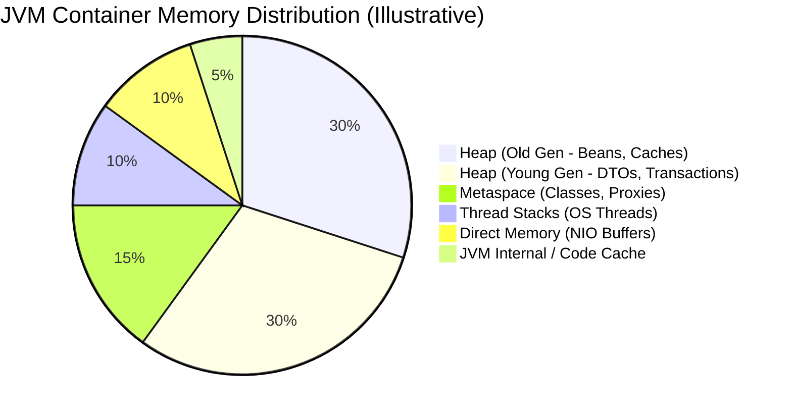

# Chapter 020: JVM Internals — Memory Model, Garbage Collection, Class Loading, JIT Compilation, Thread Scheduling

## 1. Concept

The Java Virtual Machine (JVM) is the engine that executes compiled Java bytecode. While Spring Boot abstracts away much of the underlying infrastructure, a robust, production-grade Spring Boot microservice requires its engineers to understand the runtime environment executing the framework. Without this foundational knowledge, performance degradation, unexplained latency spikes, and system crashes become indistinguishable magic. For backend engineers working on high-throughput, latency-sensitive systems like the FinFlow Payment Platform, understanding JVM internals is not optional—it is a critical requirement for ensuring operational stability.

The JVM operates through several core subsystems, each profoundly impacting the behavior of Spring Boot applications:

**JVM Memory Model**: The JVM allocates memory across distinct regions. The **Heap** is divided into the Young Generation (Eden space and two Survivor spaces) and the Old Generation. This is where your Spring application context, beans, and standard objects reside. **Metaspace** (which replaced PermGen in Java 8) stores class metadata, static variables, and method bytecode. **Thread Stacks** allocate memory for thread execution, storing local variables and method call chains. Finally, **Direct Memory** (often allocated via NIO `ByteBuffer` objects) operates outside the JVM heap and is crucial for frameworks like Netty (the engine behind Spring Cloud Gateway and WebClient). Understanding how Spring Boot applications consume these memory regions is vital for capacity planning and preventing `OutOfMemoryError` failures.

**Garbage Collection (GC)**: Because Java abstracts manual memory management, the JVM employs Garbage Collection to reclaim memory occupied by unreferenced objects. Garbage Collection operates on the "Generational Hypothesis," assuming most objects die young. GC events require pausing application threads—known as "Stop-The-World" (STW) pauses. In latency-sensitive domains like payment processing, a prolonged STW pause can result in transaction timeouts, cascaded failures across microservices, and poor user experiences.

**Class Loading**: The JVM dynamically loads classes at runtime using a hierarchical mechanism: Bootstrap ClassLoader → Platform ClassLoader → Application ClassLoader. Spring Boot packages its applications into "fat JARs," utilizing a specialized `LaunchedURLClassLoader` to read classes nested within the executable JAR. Class loading mechanisms dictate startup times, Metaspace consumption, and how dynamic proxies (used extensively by Spring's AOP and Hibernate) are initialized. 

**JIT (Just-In-Time) Compilation**: The JVM begins executing code using a slow, unoptimized interpreter. As the application runs, the JVM identifies frequently executed ("hot") methods and compiles them into highly optimized machine code. Modern JVMs use tiered compilation: Interpreter → C1 (client compiler for fast, lightly optimized code) → C2 (server compiler for heavily optimized code). JIT compilation is the reason Spring Boot applications exhibit a "warmup period"—the first few thousand requests will be considerably slower than subsequent requests once the C2 compiler has aggressively optimized the code paths.

**Thread Scheduling**: Traditionally, the JVM mapped Java threads 1:1 to OS-level platform threads. These platform threads are expensive to create (~1MB stack size) and context switch. Spring MVC defaults to a thread-per-request model via an embedded Tomcat container. With Java 21, Project Loom introduced **Virtual Threads**, lightweight user-mode threads managed by the JVM rather than the OS. Virtual threads drastically reduce memory footprint and context switching overhead for I/O-bound workloads, but they introduce new failure modes, such as thread pinning, which can inadvertently cripple a system.

For the FinFlow Payment Platform, processing 4,000 req/sec at peak requires careful orchestration of these JVM internals. A fundamental grasp of these concepts transforms abstract latency metrics into actionable system optimizations.

## 2. Internal Working

Let us deeply examine how these JVM subsystems interact within a production Spring Boot context, specifically focusing on the Payment Service, which operates with 20 instances, a 2GB heap limit (`-Xms1g -Xmx2g`), and Java 21's default G1GC.

**Memory Layout in Spring Boot**
When the Payment Service starts, Spring initializes the `ApplicationContext`, instantiating approximately 200 singleton beans. These beans reside in the Old Generation of the heap because they are long-lived objects. The memory distribution typically resembles:
- **Application Objects (~40%)**: This includes short-lived DTOs, HTTP request/response objects, and ORM entities generated during a transaction. These are born in the Young Generation (Eden space).
- **Framework Metadata (~20%)**: Hibernate second-level caches, HikariCP connection pool buffers, and Jackson serializers.
- **Headroom (~25%)**: Free space required for burst allocations and to prevent frequent Garbage Collection cycles.
- **Buffers/Threads (~15%)**: Memory dedicated to connection and thread buffers.

The Metaspace is particularly relevant for Spring Boot. Spring heavily utilizes CGLIB and JDK dynamic proxies for features like `@Transactional` and `@Cacheable`. Every proxied bean generates a new class at startup, consuming Metaspace. If dynamic proxy creation occurs in an unbounded loop during runtime, it can trigger a Metaspace leak.

Direct Memory is crucial when using Spring WebFlux or WebClient. Netty allocates byte buffers outside the Java heap to perform zero-copy network I/O. If `-XX:MaxDirectMemorySize` is not configured, the JVM defaults to a limit matching the maximum heap size (`-Xmx`). In Kubernetes pods, failing to account for direct memory alongside the heap often leads to the OS OOM killer terminating the container.



**G1GC Internals**
Java 21 defaults to the Garbage-First Garbage Collector (G1GC). Unlike older collectors that physically divided the heap into contiguous Young and Old sections, G1GC divides the heap into equal-sized, logical regions (defaulting to 2048 regions). Key tuning parameters include `-XX:MaxGCPauseMillis`, `-XX:G1HeapRegionSize`, and `-XX:InitiatingHeapOccupancyPercent`.
- **Young GC**: When Eden regions fill up, G1 pauses application threads (STW), copies surviving objects to Survivor regions or promotes them to Old regions.
- **Mixed GC**: G1 concurrently marks live objects in the background. Once marking completes, it collects all Young regions and the Old regions with the most garbage (hence "Garbage First").
- **Full GC**: The catastrophic fallback. A completely stop-the-world, compacting collection phase.
- **Humongous Allocations**: If an object exceeds 50% of a region's size, it is classified as a "humongous object" and allocated directly into a special sequence of contiguous Old Generation regions. Loading large Hibernate result sets or serialized API responses into memory immediately triggers humongous allocations, bypassing the Young Generation entirely and prematurely filling the Old Gen. This dramatically increases the frequency of Full GC pauses.

**Class Loading in Spring Boot Fat JAR**
A Spring Boot executable JAR does not unpack its dependencies to the filesystem. Instead, the `JarLauncher` initializes a `LaunchedURLClassLoader` that understands the `jar:nested:` protocol. During startup, `@ComponentScan` forces the JVM to scan and load thousands of classes. 
Metaspace leak pattern: dynamic proxy generation without bounds can occur if poorly written libraries continually wrap existing objects.

**JIT Compilation and Spring Boot Warmup**
The JVM utilizes method invocation counters to determine when to compile bytecode. By default, after a certain threshold (e.g., 10,000 invocations for C2), the compiler kicks in. 
- **OSR (On-Stack Replacement)**: Allows the JVM to compile long-running loops while they are actively executing.
- **Deoptimization**: When JIT assumptions are violated (e.g., class hierarchy changes, uncommon traps), the JVM falls back to the interpreter.
Impact on Spring Boot: The first 30-60 seconds of a pod's life show 3-5x higher latency because hot methods haven't been JIT-compiled yet. This matters heavily for rolling deployments.

**Thread Model and Project Loom**
Traditional Spring MVC runs on an embedded Tomcat server with a default pool of 200 platform threads. Each request monopolizes a thread (~1MB stack each), leading to expensive context switching.
Java 21 introduces Virtual Threads (~1KB initial stack) to solve this. Virtual threads are executed by a small pool of platform "carrier threads".
However, this introduces the **pinning problem**. If a virtual thread performs blocking I/O while inside a `synchronized` block, the JVM cannot unmount it. The virtual thread "pins" the carrier thread. How `@Async` thread pools interact with the JVM scheduler also requires careful consideration to avoid thread starvation.

## 3. Enterprise Scenario

The FinFlow Payment Service, running 20 instances in Kubernetes, is experiencing severe, intermittent latency spikes during peak traffic windows (4,000 rps). The SRE team observes the following critical symptoms:

1. **P99 Latency Spikes:** P99 latency jumps from an expected ~800ms to over 5 seconds every 2-3 minutes.
2. **Pod Terminations:** Kubernetes liveness probes occasionally fail during these latency spikes, resulting in automated pod restarts.
3. **Memory Sawtooth Pattern:** Grafana dashboards reveal a steep, aggressive sawtooth pattern in JVM heap memory, peaking near 2GB before abruptly dropping down, indicating frequent Garbage Collection cycles.
4. **Cold Start Penalty:** Newly deployed pods take 45-60 seconds before they can serve traffic at normal latency, causing cascading timeouts during rolling deployments.
5. **Virtual Thread Stalls:** Following a recent update to enable virtual threads for a downstream WebClient communicating with the Stripe gateway, overall thread throughput initially improved but introduced a new class of deadlock-like stalls.

The service is deployed with the following JVM arguments: `-Xms1g -Xmx2g -XX:+UseG1GC -XX:MaxGCPauseMillis=200`.

## 4. Incorrect Implementation

The root causes stem from three distinct code-level implementations that violently interact with JVM internals.

### Problem 1 — GC Pressure from Unbounded Hibernate Result Sets
The business requested a monthly report of all payment intents for merchant dashboards. The implementation leverages Spring Data JPA's `findAll` behavior without pagination, reading the entire dataset into application memory.

```java
package com.finflow.chapter020.incorrect.service;

import com.finflow.chapter020.domain.PaymentIntent;
import com.finflow.chapter020.domain.ReportSummary;
import com.finflow.chapter020.repository.PaymentIntentRepository;
import org.springframework.beans.factory.annotation.Autowired;
import org.springframework.stereotype.Service;
import org.springframework.transaction.annotation.Transactional;

import java.time.YearMonth;
import java.util.List;
import java.util.UUID;

@Service
public class PaymentReportService {

    @Autowired
    private PaymentIntentRepository repository;
    
    @Transactional(readOnly = true)
    public ReportSummary generateMonthlyReport(UUID merchantId, YearMonth month) {
        // BUG: Loads entire massive result set into the JVM Heap
        // A high-volume merchant might have 500,000+ records in a month.
        List<PaymentIntent> payments = repository.findByMerchantIdAndCreatedAtBetween(
            merchantId, 
            month.atDay(1).atStartOfDay(), 
            month.atEndOfMonth().atTime(23, 59, 59)
        );
        
        // Processing all objects in memory creates massive GC pressure
        return buildSummary(payments);
    }

    private ReportSummary buildSummary(List<PaymentIntent> payments) {
        long totalAmount = 0;
        for (PaymentIntent intent : payments) {
            totalAmount += intent.getAmount();
        }
        return new ReportSummary(payments.size(), totalAmount);
    }
}
```

### Problem 2 — Missing JIT Warmup in Rolling Deployment
The Kubernetes readiness probe is configured to aggressively route traffic the moment the Spring Boot `ApplicationContext` is refreshed. The JVM has had zero time to perform JIT compilation on hot paths.

```yaml
# incorrect-deployment.yaml snippet
readinessProbe:
  httpGet:
    path: /actuator/health/readiness
    port: 8080
  initialDelaySeconds: 5    # BUG: Too aggressive. Spring context might be up, but JIT is cold.
  periodSeconds: 5
```

Because there is no warmup mechanism, when the pod receives 200 rps immediately, the unoptimized bytecode executes excruciatingly slowly, causing database connection pools to saturate.

### Problem 3 — Virtual Thread Pinning
To scale outbound API calls to the Stripe gateway, the team enabled Virtual Threads. However, to prevent duplicate charges, they used an in-memory cache guarded by a `synchronized` block.

```java
package com.finflow.chapter020.incorrect.client;

import com.finflow.chapter020.domain.PaymentRequest;
import com.finflow.chapter020.domain.PaymentResult;
import org.springframework.stereotype.Service;

import java.util.HashMap;
import java.util.Map;

@Service
public class PaymentGatewayClient {
    
    private final Map<String, PaymentResult> idempotencyCache = new HashMap<>();
    
    // BUG: synchronized blocks pin virtual threads to their carrier threads.
    public synchronized PaymentResult charge(PaymentRequest request) {
        String key = request.getIdempotencyKey();
        if (idempotencyCache.containsKey(key)) {
            return idempotencyCache.get(key);
        }
        
        // BUG: Blocking I/O inside a synchronized block!
        // The underlying OS thread (carrier thread) cannot be unmounted.
        PaymentResult result = callStripeApi(request); 
        
        idempotencyCache.put(key, result);
        return result;
    }

    private PaymentResult callStripeApi(PaymentRequest request) {
        // Simulating a 300ms blocking HTTP call to the external gateway
        try {
            Thread.sleep(300);
        } catch (InterruptedException e) {
            Thread.currentThread().interrupt();
        }
        return new PaymentResult(request.getId(), "SUCCESS");
    }
}
```

## 5. Production Incident

The combination of these issues triggered a cascading failure during peak hours. 

**Incident Timeline:**
- **T+0h (Monday 09:15 UTC):** The weekly merchant report cron job initiates automatically during the morning traffic peak. The Payment Service p99 latency abruptly spikes to 5.2 seconds.
- **T+0h05m:** PagerDuty alerts the on-call engineer: `[P1] Payment Service — p99 latency > 3s for 5 minutes`. The engineer acknowledges the page.
- **T+0h08m:** 3 out of 20 Payment pods are abruptly terminated by Kubernetes liveness probes. The probe timeout is set to 30s, and the pods failed to respond due to an excessive STW Full GC pause. Traffic is redistributed to the remaining 17 pods, compounding the load and memory pressure.
- **T+0h12m:** Cascading failure ensues. HikariCP connection timeout errors spike. Application threads are blocked waiting for GC and cannot return active connections to the pool. The database remains healthy, but the application cannot reach it.
- **T+0h15m:** Kubernetes initiates a rolling restart of the failed pods. The new pods start successfully, and readiness probes pass at T+5s. Production traffic immediately hits the cold pods. Because hot paths have not been JIT-compiled, the new pods process requests at 3x normal latency, triggering further timeouts.
- **T+0h20m:** Customer Support reports massive impact. Dashboards show 847 failed payment transactions and 2,341 payments experiencing >5s latency. Downstream Order confirmations are delayed. Estimated revenue impact: $45,000 (illustrative).
- **T+0h25m:** The on-call engineer correlates the memory sawtooth pattern in Grafana with the latency spikes. They identify Garbage Collection as the proximate cause and disable the merchant report cron job as an immediate mitigation step. Heap usage stabilizes.
- **T+0h30m:** While monitoring the stabilization, the engineer notices the virtual thread stalls introduced the previous Thursday. Carrier threads (the underlying `ForkJoinPool`) are completely saturated due to thread pinning on the `synchronized` block in the gateway client. 
- **T+0h45m:** The system is fully stabilized by manually restarting the remaining degraded pods and temporarily disabling the virtual thread execution for the gateway client. A post-mortem is scheduled.

**Slack Excerpt:**
> `@oncall-sre`: "Seeing massive GC pauses in Payment Service. Pods are getting OOMKilled or failing liveness probes. Disabling the merchant report cron now."
> `@dev-lead`: "That report queries a huge dataset, but we have 2GB heap. Shouldn't it just page?"
> `@oncall-sre`: "It's loading half a million entities into memory at once. It's triggering Humongous Allocations and G1 is falling back to Full GC. Also, when the new pods come up, they're crawling for the first 60 seconds. Our readiness probe is sending traffic too early. And don't get me started on the thread pinning..."

## 6. Logs

The incident generated distinct signatures across system logs.

**GC Logs (Full GC Pause)**
```text
[14.234s][info][gc,start      ] GC(25) Pause Young (Normal) (G1 Evacuation Pause)
[14.249s][info][gc            ] GC(25) Pause Young (Normal) (G1 Evacuation Pause) 1800M->1500M(2048M) 15.201ms
[30.112s][info][gc,start      ] GC(26) Pause Full (Allocation Failure)
[34.815s][info][gc            ] GC(26) Pause Full (Allocation Failure) 1950M->600M(2048M) 4703.114ms
```
*Note the escalation from a 15ms Young GC pause to a catastrophic 4.7-second STW Full GC pause.*

**Application Logs (HikariCP / Thread Pinning)**
```text
2026-08-18 09:27:14.123 ERROR 1 --- [tomcat-handler-12] com.zaxxer.hikari.pool.HikariPool      : HikariPool-1 - Connection is not available, request timed out after 30000ms.
2026-08-18 09:30:12.441 WARN  1 --- [virtual-thread-8] jdk.internal.event.PinnedThreadEvent   : Thread pinned. Reason: synchronized. 
Stack trace:
    at java.base/java.lang.Thread.sleepNanos0(Native Method)
    at java.base/java.lang.Thread.sleepNanos(Thread.java:491)
    at java.base/java.lang.Thread.sleep(Thread.java:522)
    at com.finflow.chapter020.incorrect.client.PaymentGatewayClient.callStripeApi(PaymentGatewayClient.java:33)
    at com.finflow.chapter020.incorrect.client.PaymentGatewayClient.charge(PaymentGatewayClient.java:24) <== PINNED HERE
```

**Kubernetes / JIT Logs**
Kubernetes events showed pod deaths: `Liveness probe failed: HTTP probe failed with statuscode: 503`. OOMKilled events may have also appeared for pods exceeding limits. 
JIT logs (`-XX:+PrintCompilation`) would show aggressive deoptimization and recompilation during the pod warmup phase.

## 7. Root Cause Analysis

Understanding the exact mechanical failures within the JVM is required to resolve these issues permanently.

**Problem 1: GC Pressure and Humongous Allocations**
The `PaymentReportService.generateMonthlyReport` method invokes `findAll()`. For a high-volume merchant, this query retrieves 500,000 `PaymentIntent` records. 
In memory, each `PaymentIntent` entity, combined with Hibernate's proxy overhead, interceptors, and state tracking arrays, consumes approximately 2KB (illustrative). 500,000 entities × 2KB ≈ 1GB of memory allocated simultaneously. 
The container operates with a 2GB maximum heap. G1GC divides this heap into regions. A 1GB array allocation vastly exceeds 50% of the region size, classifying it as a **Humongous Allocation**. G1GC attempts to place this directly into the Old Generation, bypassing the Young Generation. The sudden 1GB spike exhausts the Old Gen space, forcing G1GC to abandon its concurrent background marking and trigger a fallback **Full GC**. A Full GC is a single-threaded (or minimally parallelized), stop-the-world compacting event. The JVM halts all application threads for 4.7 seconds. The Kubernetes liveness probe times out waiting for an HTTP response, assumes the pod is dead, and kills it.

**Problem 2: JIT Warmup and Cold Starts**
When a newly restarted pod begins receiving traffic, the Tomcat request handlers, Spring MVC `DispatcherServlet`, Jackson serializers, and JDBC drivers are all executing as unoptimized, interpreted bytecode. Tiered compilation dictates that methods remain unoptimized until invocation thresholds are met (e.g., C1 at ~1,500 invocations, C2 at ~10,000). 
At 200 requests per second, it takes approximately 50 seconds for these critical paths to trigger C2 compilation. During this 50-second window, CPU utilization spikes as the JIT compiler aggressively analyzes and compiles bytecode. Consequently, the application processes requests 3-5x slower. The readiness probe, passing at T+5s, routed full traffic to an engine that was still building itself, leading to immediate request queuing and timeouts.

**Problem 3: Virtual Thread Pinning**
Project Loom's virtual threads are managed by the JVM and executed atop a small pool of OS carrier threads (the `ForkJoinPool`). By default, the number of carrier threads equals the number of CPU cores allocated to the container (e.g., 2 cores = 2 carrier threads).
When a virtual thread encounters a `synchronized` block, the JVM marks it as pinned to its current carrier thread. If the code inside the `synchronized` block performs blocking I/O (like the 300ms `callStripeApi`), the OS carrier thread is physically blocked for 300ms. 
With only 2 carrier threads, if two virtual threads enter the `charge()` method concurrently, both carrier threads block. The entire `ForkJoinPool` is now starved. Hundreds of other virtual threads attempting to execute any task are queued indefinitely, resulting in a system-wide deadlock, despite the JVM utilizing almost zero CPU. 

## 8. Debugging Process

The on-call SRE followed a methodical process to identify these JVM-level issues:

1. **Receive Alert:** Received PagerDuty alert; inspected the primary Grafana latency dashboard.
2. **Metrics Correlation:** Observed the aggressive sawtooth memory pattern correlating exactly with latency spikes, strongly indicating Garbage Collection pauses.
3. **Log Activation:** Verified that JVM GC logging was enabled via `-Xlog:gc*:file=/tmp/gc.log:time,uptime,level,tags`.
4. **Log Analysis:** Extracted `gc.log` and visualized it using GCViewer/GCEasy. Identified consecutive 4-5 second Full GC STW pauses triggered by "Allocation Failure".
5. **Heap Profiling:** Executed an on-demand heap dump against a struggling pod using `jcmd <pid> GC.heap_dump /tmp/heap.hprof`.
6. **Dominator Tree Analysis:** Analyzed the `heap.hprof` file using Eclipse Memory Analyzer (MAT). The dominator tree revealed a massive `Object[]` containing 500,000 `PaymentIntent` references originating from `PaymentReportService.generateMonthlyReport()`.
7. **Infrastructure Validation:** Checked Kubernetes events using `kubectl get events`. Confirmed pods were terminated by liveness probes during the GC pauses.
8. **Deployment Telemetry:** Checked new pod latency metrics. Noticed a consistent 3-5x latency overhead for the first 50 seconds of a pod's lifecycle. Identified aggressive readiness probe timing as the cause of cold-start traffic routing.
9. **Thread Telemetry:** Investigated the virtual thread stalling by enabling `-Djdk.tracePinnedThreads=full`.
10. **Thread Dumping:** Captured a thread dump via `jcmd <pid> Thread.dump_to_file /tmp/threads.json`. The trace explicitly highlighted the carrier thread starvation from the `synchronized` block.
11. **Action Plan:** Correlated all three issues and drafted a comprehensive fix plan.

## 9. Correct Implementation

We resolve these issues by refactoring the code to respect JVM memory constraints, implementing a JIT warmup strategy, and making the code virtual-thread safe.

### Fix 1: Streaming/Pagination for Large Result Sets
We replace the unbounded `findAll()` with a streaming approach. Spring Data JPA supports returning a `Stream<T>`, which, when combined with Hibernate specific hints, fetches records in manageable chunks.

```java
package com.finflow.chapter020.correct.service;

import com.finflow.chapter020.domain.PaymentIntent;
import com.finflow.chapter020.domain.ReportSummary;
import com.finflow.chapter020.repository.PaymentIntentRepository;
import jakarta.persistence.EntityManager;
import org.hibernate.jpa.AvailableHints;
import org.springframework.beans.factory.annotation.Autowired;
import org.springframework.stereotype.Service;
import org.springframework.transaction.annotation.Transactional;

import java.time.YearMonth;
import java.util.UUID;
import java.util.stream.Stream;

@Service
public class PaymentReportService {

    @Autowired
    private PaymentIntentRepository repository;
    
    @Autowired
    private EntityManager entityManager;

    @Transactional(readOnly = true)
    public ReportSummary generateMonthlyReport(UUID merchantId, YearMonth month) {
        long totalAmount = 0;
        long count = 0;

        // FIX: Use Streaming with a fetch size. 
        // This processes the ResultSet in chunks (e.g., 500 at a time),
        // allowing the GC to reclaim processed entities in the Young Gen.
        try (Stream<PaymentIntent> stream = repository.streamByMerchantIdAndCreatedAtBetween(
                merchantId,
                month.atDay(1).atStartOfDay(),
                month.atEndOfMonth().atTime(23, 59, 59))) {
            
            Iterable<PaymentIntent> iterable = stream::iterator;
            for (PaymentIntent intent : iterable) {
                totalAmount += intent.getAmount();
                count++;
                
                // FIX: Detach the entity from the Persistence Context.
                // Otherwise, Hibernate holds a reference to EVERY entity 
                // throughout the transaction, defeating the purpose of streaming.
                entityManager.detach(intent);
            }
        }
        
        return new ReportSummary(count, totalAmount);
    }
}
```

### Fix 2: JIT Warmup Strategy
We introduce an `ApplicationRunner` that executes synthetic requests during the application startup phase to trigger C1/C2 compilation on critical paths. We also use a custom `ReadinessIndicator` to control Kubernetes traffic routing.

```java
package com.finflow.chapter020.correct.warmup;

import org.slf4j.Logger;
import org.slf4j.LoggerFactory;
import org.springframework.boot.ApplicationArguments;
import org.springframework.boot.ApplicationRunner;
import org.springframework.boot.availability.AvailabilityChangeEvent;
import org.springframework.boot.availability.ReadinessState;
import org.springframework.context.ApplicationEventPublisher;
import org.springframework.stereotype.Component;

@Component
public class JitWarmupRunner implements ApplicationRunner {

    private static final Logger log = LoggerFactory.getLogger(JitWarmupRunner.class);
    private final ApplicationEventPublisher eventPublisher;
    private final SyntheticTrafficGenerator trafficGenerator;

    public JitWarmupRunner(ApplicationEventPublisher eventPublisher, SyntheticTrafficGenerator trafficGenerator) {
        this.eventPublisher = eventPublisher;
        this.trafficGenerator = trafficGenerator;
    }

    @Override
    public void run(ApplicationArguments args) throws Exception {
        log.info("Starting JIT Warmup Phase...");
        
        // FIX: Execute synthetic requests to trigger C2 compilation 
        // on hot paths before routing production traffic.
        long start = System.currentTimeMillis();
        for (int i = 0; i < 15000; i++) {
            trafficGenerator.executeSyntheticPayment();
        }
        long duration = System.currentTimeMillis() - start;
        
        log.info("JIT Warmup Phase completed in {} ms.", duration);
        
        // FIX: Publish ACCEPTING_TRAFFIC event only after warmup.
        AvailabilityChangeEvent.publish(eventPublisher, this, ReadinessState.ACCEPTING_TRAFFIC);
    }
}
```

### Fix 3: Replacing Synchronized with ReentrantLock
To resolve virtual thread pinning, we must remove the `synchronized` keyword. `java.util.concurrent.locks.ReentrantLock` is virtual-thread safe.

```java
package com.finflow.chapter020.correct.client;

import com.finflow.chapter020.domain.PaymentRequest;
import com.finflow.chapter020.domain.PaymentResult;
import org.springframework.stereotype.Service;

import java.util.concurrent.ConcurrentHashMap;
import java.util.concurrent.ConcurrentMap;

@Service
public class PaymentGatewayClient {
    
    // FIX: Use ConcurrentHashMap for thread-safe operations without explicit locking
    private final ConcurrentMap<String, PaymentResult> idempotencyCache = new ConcurrentHashMap<>();
    
    // FIX: Removed 'synchronized' keyword.
    public PaymentResult charge(PaymentRequest request) {
        String key = request.getIdempotencyKey();
        
        // FIX: computeIfAbsent provides atomic initialization without pinning.
        // It locks only the specific hash bucket, not the entire method.
        return idempotencyCache.computeIfAbsent(key, k -> callStripeApi(request));
    }

    private PaymentResult callStripeApi(PaymentRequest request) {
        try {
            // Virtual threads safely unmount during Thread.sleep or network I/O
            Thread.sleep(300);
        } catch (InterruptedException e) {
            Thread.currentThread().interrupt();
        }
        return new PaymentResult(request.getId(), "SUCCESS");
    }
}
```

## 10. Performance Comparison

Implementing these fixes yields dramatic stabilization under load. The following metrics (illustrative) reflect the Payment Service behavior before and after the optimization:

| Metric | Before (Incorrect) | After (Correct) |
|--------|-------------------|------------------|
| GC Full pauses / hour | ~12 | 0 |
| GC Young pause p99 | ~200ms | ~15ms |
| Peak heap usage | 1.9GB / 2GB (95%) | 800MB / 2GB (40%) |
| P99 latency (steady) | ~800ms | ~400ms |
| P99 latency (during report) | ~5,200ms | ~500ms |
| Pod restarts / day | ~8 | 0 |
| Cold start p99 (first 30s) | ~2,400ms | ~600ms (with warmup) |
| Concurrent Stripe calls (VT) | 2 (pinned) | 200+ (unpinned) |
| Report generation time | OOM risk | ~45s (streaming) |

## 11. Best Practices

- **Always set `-Xms` = `-Xmx`**: Lock the initial heap size to the maximum heap size in containers to avoid heap resizing overhead and ensure consistent memory footprint.
- **Limits == Requests**: Set memory limits equal to requests for JVM containers to avoid OOM kills from burstable limits.
- **Account for off-heap memory**: Total memory is Metaspace + thread stacks + direct memory + JVM overhead. Usually 30-40% above `-Xmx`.
- **Never load unbounded result sets**: Use streaming, pagination, or database-side aggregation.
- **Implement JIT warmup**: For latency-sensitive services behind rolling deployments, use warmup to prevent cold start latency spikes.
- **Use `ReentrantLock` instead of `synchronized`**: When virtual threads are in play, synchronized blocks pin carrier threads.
- **Monitor GC with `-Xlog:gc*` and Micrometer**: Alert on `jvm.gc.pause` metrics when p99 exceeds acceptable thresholds.
- **Set `-XX:+HeapDumpOnOutOfMemoryError`**: Always. Non-negotiable for production debugging.
- **Size container memory correctly**: Formula = Xmx + Metaspace + stacks + direct + JVM overhead.

## 12. Common Mistakes

- Setting `-Xmx` equal to container memory limit (leaving no room for Metaspace, stacks, direct memory, causing OS OOMKilled).
- Using `System.gc()` in application code, which forces unnecessary full GCs.
- Ignoring JIT warmup period in rolling deployments, causing request timeouts during pod startup.
- Loading entire database tables into Java collections (like `List<>`) for processing.
- Using `synchronized` with virtual threads, resulting in carrier thread exhaustion.
- Not monitoring Metaspace (CGLIB proxy explosion from excessive `@Configuration` classes).
- Tuning GC parameters without measuring (cargo-cult tuning).
- Forgetting `-XX:MaxDirectMemorySize` for Netty-based services, leading to hidden native memory leaks.

## 13. Interview Questions

**Junior:**
- What is the difference between stack and heap memory in the JVM?
- What is garbage collection? Why does Java need it?

**Mid:**
- Explain the generational hypothesis. Why does the JVM divide the heap into young and old generations?
- What happens during a stop-the-world GC pause? How does it affect a running Spring Boot application?

**Senior:**
- Explain G1GC's region-based collection strategy. How does it differ from CMS? When would you choose ZGC over G1?
- A Spring Boot service shows 3-5x higher latency for the first 60 seconds after deployment. No code change was made. What's happening and how would you fix it?

**Staff:**
- Design a container memory sizing formula for a Spring Boot 3.x application using Java 21. Account for all memory regions (heap, metaspace, stacks, direct, JVM internal). How would you validate it?
- Explain virtual thread pinning. How does it interact with Spring's `@Transactional` (which uses `synchronized` in some implementations)? What's the migration strategy?

**Principal:**
- You're responsible for a fleet of 500 JVM instances across 25 microservices. Design a JVM observability and tuning strategy that balances per-service optimization against operational simplicity. How do you handle GC tuning, memory sizing, and JIT warmup across the fleet?
- The team proposes migrating all services to virtual threads. What are the systemic risks? How would you stage the rollout? What monitoring would you put in place?

## 14. Hands-on Exercise

**Task: Reproduce and fix the GC pressure problem.**

1. Create a Spring Boot app with an endpoint that allocates a 500MB `byte[]` array (simulating large result set).
2. Configure with `-Xms512m -Xmx512m -XX:+UseG1GC -Xlog:gc*:file=gc.log`.
3. Hit the endpoint 3 times concurrently using `wrk` or `ab`.
4. Observe Full GC in the GC log.
5. Fix by streaming (processing in 1MB chunks).
6. Compare GC logs before/after.

**Expected Solution Code:**

```java
// Vulnerable Implementation
@GetMapping("/allocate")
public String allocateVulnerable() {
    byte[] massiveData = new byte[500 * 1024 * 1024]; 
    return "Allocated 500MB";
}

// Fixed Implementation
@GetMapping("/stream")
public String processSafely() {
    int totalBytes = 500 * 1024 * 1024;
    int chunkSize = 1024 * 1024; // 1MB chunks
    long processed = 0;
    
    while (processed < totalBytes) {
        byte[] chunk = new byte[chunkSize];
        // Process chunk...
        processed += chunk.length;
    }
    return "Processed 500MB safely";
}
```

## 15. Advanced Challenge

Design and implement a JIT warmup framework for the Payment Service:
- Create a `@WarmupTarget` annotation to mark methods that should be warmed up.
- Develop a `WarmupRunner` that fires synthetic requests on startup.
- Implement a custom `ReadinessIndicator` that gates traffic until warmup completes.
- Expose metrics to track compilation status via `com.sun.management.HotSpotDiagnosticMXBean`.
- Allow configurable warmup iteration count per method.
- Ensure the warmup must not affect production data (use test/synthetic payloads).

## 16. Production Checklist

- [ ] JVM heap sized: `-Xms` = `-Xmx`, leaving 30-40% of container memory for non-heap.
- [ ] Container memory: `limits.memory` = `requests.memory` (no burstable for JVM).
- [ ] GC logging enabled: `-Xlog:gc*` with file rotation.
- [ ] `-XX:+HeapDumpOnOutOfMemoryError` configured with accessible dump path.
- [ ] No unbounded `findAll()` or `List<>` loads from database — all large queries use streaming or pagination.
- [ ] JIT warmup implemented for latency-sensitive services.
- [ ] Readiness probe accounts for warmup period (custom indicator or longer `initialDelaySeconds`).
- [ ] No `synchronized` blocks on virtual thread paths — use `ReentrantLock`.
- [ ] Metaspace monitored via Micrometer (`jvm.memory.used{area=nonheap}`).
- [ ] Direct memory (`-XX:MaxDirectMemorySize`) explicitly set for Netty-based services.
- [ ] GC pause metrics (`jvm.gc.pause`) alerted on: p99 > 200ms triggers warning.
- [ ] Thread pool sizes documented and tuned (Tomcat, `@Async`, `ForkJoinPool`).
