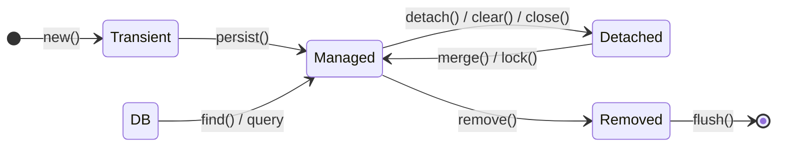

# Chapter 130: Hibernate Internals & Entity Lifecycle

Understanding how Hibernate manages entities is the difference between a high-performance backend and a system plagued by `OutOfMemoryError`, lost updates, and duplicate processing. In Spring Boot applications, the simplicity of Spring Data JPA (`save()`, `findById()`) often obscures the complex lifecycle of entities within the persistence context. 

This chapter pulls back the curtain on Hibernate's `Session` and `SessionFactory`, dissecting the four entity states and how transitions between them affect your application's reliability and performance. We will explore a critical production incident in the FinFlow Payment Platform caused by a subtle misunderstanding of the `merge()` operation, leading to a significant financial loss.

---

## 1. Concept

At its core, JPA (Java Persistence API) is a specification, and Hibernate is its most popular implementation. Spring Data JPA sits on top of this, providing repository abstractions. To truly master data access, we must look beyond the JPA specification to Hibernate's internal mechanics.

### EntityManagerFactory vs. SessionFactory
*   **`EntityManagerFactory` (JPA) / `SessionFactory` (Hibernate):** This is a heavyweight, thread-safe, immutable object created once during application startup. It parses metadata (annotations, XML), connects to the database, and maintains the second-level cache. 
*   **`EntityManager` (JPA) / `Session` (Hibernate):** This is a lightweight, non-thread-safe, short-lived object representing a single unit of work (typically bound to a single transaction). It wraps a JDBC connection and holds the first-level cache (the Persistence Context).

### The Four Entity States
Hibernate tracks Java objects in memory and maps them to database rows. An entity instance is always in exactly one of four states relative to a specific `Session` (Persistence Context):

1.  **Transient:** The entity has just been instantiated using the `new` keyword. It has no database identity (no primary key assigned) and is not associated with any `Session`.
2.  **Managed (Persistent):** The entity has a database identity and is currently tracked by an active `Session`. Any changes made to its fields will be automatically synchronized with the database when the session is flushed (Dirty Checking).
3.  **Detached:** The entity has a database identity, but it is no longer associated with an active `Session`. This happens when the session is closed, cleared, or the entity is explicitly detached or serialized across boundaries (e.g., sent over REST or Kafka). Changes made to a detached entity are *not* automatically saved.
4.  **Removed:** The entity is scheduled for deletion from the database. It is still associated with the `Session`, but upon flush, an `SQL DELETE` statement will be executed.

---

## 2. Internal Working

To understand *why* Hibernate behaves the way it does, we need to look at its internal data structures.

### The Stateful Persistence Context

When you interact with a `Session` (`EntityManager`), you are interacting with its `StatefulPersistenceContext`. This context is essentially a set of internal maps that track entities and their state.

*   **`entitiesByKey`:** A map where the key is the `EntityKey` (Class + Identifier) and the value is the managed entity instance. This guarantees that within a single session, reading the same database row multiple times returns the *exact same Java object reference* (identity = equality).
*   **`entityEntries`:** An IdentityMap (using `==` instead of `equals()`) linking the entity instance to an `EntityEntry`.
*   **`EntityEntryImpl`:** This critical internal object stores the metadata for a managed entity:
    *   `Status`: `MANAGED`, `LOADED`, `DELETED`, `READ_ONLY`, `SAVING`, etc.
    *   `loadedState`: An array of object values representing the entity's state at the exact moment it was loaded from the database. This snapshot is what Hibernate uses for dirty checking during a flush.

### State Transitions and Methods

*   **`persist(entity)`:** Takes a transient entity, assigns it an identifier, adds it to the Persistence Context, and marks it as managed. If called on a detached entity, it throws an exception.
*   **`merge(entity)`:** Takes a detached entity and copies its state onto a managed entity with the same identifier. **Crucially, it returns the managed instance.** The original detached entity passed as an argument remains detached.
*   **`remove(entity)`:** Marks a managed entity for deletion.
*   **`detach(entity)` / `clear()`:** Removes an entity (or all entities) from the `entitiesByKey` and `entityEntries` maps, transitioning them to the detached state. The loaded snapshot array is discarded, freeing memory.
*   **`flush()`:** Iterates over all managed entities, compares their current field values against the `loadedState` snapshot (dirty checking), and generates necessary SQL `UPDATE`, `INSERT`, or `DELETE` statements.

### State Transition Diagram



---

## 3. Enterprise Scenario

In the FinFlow Payment Platform, we handle a peak load of 4,000 req/sec. One of our critical background processes is the **Batch Refund Reconciliation Pipeline**.

When refunds fail or are delayed by the third-party gateway, they enter a `PENDING` state. A background Kafka worker periodically fetches batches of 5,000 pending `Refund` and `PaymentSettlementEntity` records, communicates with the gateway to check their true status, and updates our database to either `PROCESSED` or `FAILED`.

This pipeline crosses multiple architectural boundaries:
1.  **Read Node:** A read-only replica queries the 5,000 pending records.
2.  **Message Broker:** The records are serialized into DTOs (Detached Entities conceptually) and pushed to a Kafka topic.
3.  **Processing Node:** A worker pulls the messages, re-hydrates the detached entities, calls the gateway, updates the state, and attempts to save the changes back to the primary database using `merge()`.

---

## 4. Incorrect Implementation

The following code was deployed by a mid-level engineer who fundamentally misunderstood how `merge()` works in Hibernate.

### Problem 1: The `merge()` Return Value Trap

```java
package com.finflow.chapter130.incorrect;

import com.finflow.chapter130.domain.PaymentSettlementEntity;
import jakarta.persistence.EntityManager;
import org.springframework.stereotype.Service;
import org.springframework.transaction.annotation.Transactional;

import java.util.List;

@Service
public class BadSettlementLifecycleService {

    private final EntityManager entityManager;

    public BadSettlementLifecycleService(EntityManager entityManager) {
        this.entityManager = entityManager;
    }

    @Transactional
    public void processSettlementBatch(List<PaymentSettlementEntity> detachedSettlements) {
        for (PaymentSettlementEntity settlement : detachedSettlements) {
            // ERROR 1: Ignoring the return value of merge()
            entityManager.merge(settlement); 
            
            // The 'settlement' instance is STILL detached.
            // We are modifying the detached instance, not the managed one in the Persistence Context.
            settlement.setStatus("PROCESSED"); 
            settlement.setProcessedAt(System.currentTimeMillis());
            
            // When the transaction commits, Hibernate flushes.
            // The managed instance (returned by merge, but ignored) has no changes.
            // Result: No SQL UPDATE is generated. The database is never updated.
        }
    }
}
```

### Problem 2: Calling `persist()` on a Detached Entity

```java
    @Transactional
    public void saveNewSettlement(PaymentSettlementEntity entity) {
        // Assume this entity came from a REST payload and already has an ID set
        // UUID id = UUID.fromString("...");
        // entity.setId(id);
        
        // ERROR 2: Calling persist on an entity with a pre-assigned ID
        // Throws: PersistentObjectException: detached entity passed to persist
        entityManager.persist(entity);
    }
```

### Problem 3 & 4: Unintended Dirty Checking and Memory Leaks

```java
    @Transactional
    public void readOnlyReportProcessing() {
        // Fetches 10,000 entities into the Persistence Context
        List<PaymentSettlementEntity> settlements = entityManager.createQuery(
                "SELECT p FROM PaymentSettlementEntity p WHERE p.status = 'PENDING'", 
                PaymentSettlementEntity.class).getResultList();
                
        for (PaymentSettlementEntity s : settlements) {
            // ERROR 3: Modifying a managed entity in what should be a read-only workflow.
            // This triggers an UPDATE on flush.
            s.setCalculatedFee(calculateFee(s)); 
        }
        
        // ERROR 4: Accumulating 10,000 entities in the Session without clear().
        // The EntityEntryImpl and loadedState snapshots consume ~12KB per entity.
        // 10,000 * 12KB = 120MB held in memory until the transaction ends.
        // Under concurrent load, this causes OutOfMemoryError.
    }
```

---

## 5. Production Incident

**Date:** Black Friday Weekend
**Impact:** 1,200 duplicate refund payouts, resulting in a **$180,000 financial loss**.

**The Event:**
During a surge in refund requests, the third-party gateway degraded, causing thousands of refunds to queue in the `PENDING` state. The Batch Refund Reconciliation Pipeline picked up these records. 

The worker executed the `BadSettlementLifecycleService.processSettlementBatch()` method. It successfully called the gateway, verified the refunds were processed, and called `entityManager.merge(settlement)`. It then set the status to `PROCESSED`.

**The Failure:**
Because the code ignored the return value of `merge()` and modified the original detached instance, Hibernate's Persistence Context never saw the state change. The transaction committed successfully, but no `UPDATE` statements were executed against the database. 

The records remained `PENDING` in the database.

One hour later, the reconciliation worker ran again, picked up the exact same `PENDING` records, and issued new refund commands to the gateway. Because the original idempotency keys were no longer in the short-lived Redis cache (TTL expired), the gateway processed them as new requests. This loop repeated twice before the alert fired, resulting in triple-refunds for 600 customers.

---

## 6. Logs

The initial clue was the complete absence of `UPDATE` statements in the database logs, despite the application logs claiming success.

```log
2026-11-27T10:15:22 [kafka-coordinator-3] INFO  c.f.c.i.BadSettlementLifecycleService - traceId=abc1234 - Processing batch of 5000 pending settlements
2026-11-27T10:15:23 [kafka-coordinator-3] DEBUG org.hibernate.SQL - traceId=abc1234 - select p1_0.id, p1_0.status, ... from payment_settlement p1_0 where p1_0.id=?
2026-11-27T10:15:23 [kafka-coordinator-3] DEBUG org.hibernate.SQL - traceId=abc1234 - select p1_0.id, p1_0.status, ... from payment_settlement p1_0 where p1_0.id=?
... (5000 select statements triggered by merge())
2026-11-27T10:15:28 [kafka-coordinator-3] INFO  c.f.c.i.BadSettlementLifecycleService - traceId=abc1234 - Successfully processed 5000 settlements
2026-11-27T10:15:28 [kafka-coordinator-3] DEBUG org.springframework.orm.jpa.JpaTransactionManager - traceId=abc1234 - Initiating transaction commit
2026-11-27T10:15:28 [kafka-coordinator-3] DEBUG org.hibernate.engine.transaction.internal.TransactionImpl - traceId=abc1234 - committing
# CRITICAL MISSING PIECE: No "update payment_settlement set status=..." logged here!
```

Additionally, later in the day, when a junior engineer tried to hotfix by manually re-inserting records using the wrong API:
```log
2026-11-27T11:45:10 [http-nio-8080-exec-12] ERROR o.a.c.c.C.[.[.[/].[dispatcherServlet] - Servlet.service() for servlet [dispatcherServlet] in context with path [] threw exception
org.springframework.dao.InvalidDataAccessApiUsageException: detached entity passed to persist: com.finflow.chapter130.domain.PaymentSettlementEntity
	at org.springframework.orm.jpa.vendor.HibernateJpaDialect.convertHibernateAccessException(HibernateJpaDialect.java:318)
	at org.springframework.orm.jpa.vendor.HibernateJpaDialect.translateExceptionIfPossible(HibernateJpaDialect.java:246)
	at org.springframework.orm.jpa.AbstractEntityManagerFactoryBean.translateExceptionIfPossible(AbstractEntityManagerFactoryBean.java:550)
Caused by: org.hibernate.PersistentObjectException: detached entity passed to persist: com.finflow.chapter130.domain.PaymentSettlementEntity
	at org.hibernate.event.internal.DefaultPersistEventListener.onPersist(DefaultPersistEventListener.java:120)
```

---

## 7. Root Cause Analysis

The root cause lies in the precise memory mechanics of the `merge()` operation.

1.  When `entityManager.merge(detachedEntity)` is called, Hibernate checks the `StatefulPersistenceContext` (`entitiesByKey` map) for an existing managed instance with the same ID.
2.  If not found, it issues a `SELECT` statement to load the entity from the database into the Persistence Context. This creates a *new* Java object reference (the managed instance).
3.  Hibernate then copies the state (field values) from the `detachedEntity` onto the newly loaded managed instance.
4.  **Crucially, `merge()` returns the reference to the managed instance.**
5.  The original `detachedEntity` reference remains completely untouched and is still detached.

In our incident, the engineer updated the `detachedEntity` *after* calling `merge()`. The managed instance inside the Persistence Context remained unmodified. When the transaction committed and `flush()` occurred, Hibernate's dirty checking compared the managed instance's current state against its `loadedState` snapshot. Finding them identical, it generated no `UPDATE` statement.

---

## 8. Debugging Process

To prove this behavior in our post-mortem, we added diagnostic logging using `System.identityHashCode()` and the `Session.contains()` method.

```java
public void debugMerge(PaymentSettlementEntity detached) {
    System.out.println("Detached Hash: " + System.identityHashCode(detached));
    System.out.println("Is detached managed? " + entityManager.contains(detached)); // false
    
    PaymentSettlementEntity managed = entityManager.merge(detached);
    
    System.out.println("Managed Hash: " + System.identityHashCode(managed));
    System.out.println("Is managed managed? " + entityManager.contains(managed)); // true
    
    // Hash codes differ! They are distinct objects in memory.
}
```

By enabling `spring.jpa.properties.hibernate.show_sql=true` and `spring.jpa.properties.hibernate.format_sql=true`, we definitively observed that the dirty checking mechanism was bypassing the entity because the `managed` instance had not been mutated.

---

## 9. Correct Implementation

The corrected code handles state transitions deliberately, utilizes batch processing to prevent memory bloat, and uses read-only hints for non-mutating workflows.

```java
package com.finflow.chapter130.correct;

import com.finflow.chapter130.domain.PaymentSettlementEntity;
import jakarta.persistence.EntityManager;
import org.hibernate.Session;
import org.springframework.stereotype.Service;
import org.springframework.transaction.annotation.Transactional;

import java.util.List;
import java.util.stream.Stream;

@Service
public class CorrectSettlementLifecycleService {

    private final EntityManager entityManager;
    private static final int BATCH_SIZE = 50; // Matches hibernate.jdbc.batch_size

    public CorrectSettlementLifecycleService(EntityManager entityManager) {
        this.entityManager = entityManager;
    }

    @Transactional
    public void processSettlementBatch(List<PaymentSettlementEntity> detachedSettlements) {
        int count = 0;
        for (PaymentSettlementEntity detached : detachedSettlements) {
            
            // 1. Correct Merge Usage: Capture the returned managed instance
            PaymentSettlementEntity managed = entityManager.merge(detached);
            
            // 2. Modify the MANAGED instance, not the detached one
            managed.setStatus("PROCESSED");
            managed.setProcessedAt(System.currentTimeMillis());
            
            // 3. Batch processing: flush and clear periodically to prevent OOM
            count++;
            if (count % BATCH_SIZE == 0) {
                // Synchronize changes to DB in a JDBC batch
                entityManager.flush(); 
                // Clear the Persistence Context to free memory (removes loadedState snapshots)
                entityManager.clear(); 
            }
        }
    }

    @Transactional
    public void saveNewSettlement(PaymentSettlementEntity entity) {
        // If we know it's a new entity, persist() is more efficient than merge()
        // It avoids the pre-SELECT check that merge() performs.
        entityManager.persist(entity);
    }

    @Transactional(readOnly = true)
    public void generateReport() {
        // Use a Stream and read-only hints for massive datasets
        try (Stream<PaymentSettlementEntity> stream = entityManager.createQuery(
                "SELECT p FROM PaymentSettlementEntity p WHERE p.status = 'PROCESSED'", 
                PaymentSettlementEntity.class)
                // Hibernate won't keep loadedState snapshots for dirty checking
                .setHint("org.hibernate.readOnly", true) 
                .getResultStream()) {
            
            stream.forEach(settlement -> {
                // Process settlement for report
                // Even if we modify it here, it won't be flushed to DB
            });
        }
    }
}
```

---

## 10. Performance Comparison

Understanding entity states directly impacts performance, primarily in database round-trips and memory footprint.

*   **`persist()` vs. `merge()` for New Entities:**
    *   `persist(newEntity)`: Immediately schedules an `INSERT`. **(1 DB call)**
    *   `merge(newEntityWithId)`: Hibernate must verify if it exists. It executes a `SELECT`. Finding nothing, it schedules an `INSERT`. **(2 DB calls)**. At 4,000 req/sec, this extra `SELECT` halves database throughput.
*   **Memory Consumption (10,000 Entities):**
    *   Without `clear()`: All 10,000 entities + `EntityEntry` objects + `loadedState` snapshots reside in memory. **~(illustrative) 120MB heap consumed.**
    *   With chunked `flush()` and `clear()` every 50 records: Only 50 entities are ever in memory at once. **~(illustrative) 8MB heap consumed.** GC pauses are significantly shorter.

---

## 11. Best Practices

1.  **Always capture the return value of `merge()`.** `Entity e = entityManager.merge(detachedE);`
2.  **Use `persist()` for guaranteed inserts.** If you know an entity is new (e.g., using a generated ID), use `persist()`. Avoid `merge()` to bypass the unnecessary `SELECT` statement.
3.  **Manage your Persistence Context size.** For bulk operations, loop through your collection, and every N iterations (matching your JDBC batch size), call `entityManager.flush(); entityManager.clear();`.
4.  **Use `@Transactional(readOnly = true)` for read-heavy operations.** This disables dirty checking. Hibernate won't allocate the `loadedState` arrays, saving CPU and memory.
5.  **Use `Session.contains()` for debugging.** If you aren't sure if an object is managed, ask the Session.

---

## 12. Common Mistakes

*   **Modifying the argument passed to `merge()`:** Expecting those changes to be flushed to the database.
*   **Assuming Spring Data JPA `save()` is magical:** Under the hood, `save(entity)` checks if the entity is new. If new, it calls `persist()`. If not, it calls `merge()`. This means `save()` on a detached entity suffers the same `merge()` return value trap if you don't use the returned object.
*   **Forgetting to implement `equals()` and `hashCode()` correctly:** Hibernate relies on identifiers for equality when merging detached entities. If you implement custom equality based on business keys, ensure it's robust across state transitions.
*   **Holding references to entities after `clear()`:** If you call `entityManager.clear()`, all entities become detached. If you then try to lazy-load a collection on one of those detached entities, you will get a `LazyInitializationException`.

---

## 13. Interview Questions

*   **Junior:** What is the difference between a Transient and a Managed entity in Hibernate?
*   **Mid:** Explain what happens internally when you call `entityManager.merge()`. What does it return?
*   **Senior:** Why might processing 100,000 records in a single transaction using JPA cause an `OutOfMemoryError`, and how do you fix it without changing the transaction boundaries?
*   **Staff:** Contrast the performance implications of using `persist()` versus `merge()` when inserting a new entity with a client-provided primary key (e.g., a UUID generated in a mobile app).
*   **Principal:** Detail how the `StatefulPersistenceContext` implements dirty checking. What data structures (`entitiesByKey`, `EntityEntry`, `loadedState`) are involved during a `flush()`?

---

## 14. Hands-on Exercise

**Objective:** Implement a robust batch processing loop.

1.  Create a `BatchProcessorService`.
2.  Write a method that takes a `List<PaymentSettlementEntity>` of size 5,000 (all detached).
3.  Configure `application.yml` with `spring.jpa.properties.hibernate.jdbc.batch_size=50`.
4.  Implement the loop to merge, update the status, and correctly call `flush()` and `clear()` every 50 records.
5.  Write a unit test that verifies (using Mockito on the `EntityManager`) that `flush()` and `clear()` were called exactly 100 times.

---

## 15. Advanced Challenge

Implement a custom Hibernate `Interceptor` (extending `EmptyInterceptor` or implementing `StatementInspector`).

1.  Override the `onFlushDirty()` method.
2.  Detect if the current transaction is marked as read-only (you may need to integrate with Spring's `TransactionSynchronizationManager`).
3.  If a developer accidentally modifies a managed entity during a read-only transaction, throw a custom `ReadOnlyMutationException` to fail fast rather than silently ignoring the update or accidentally committing it.

---

## 16. Production Checklist

**Reviewer checklist for PR review gates:**

*   [ ] Does the code capture and use the returned instance when calling `entityManager.merge()` or Spring Data's `repository.save()`?
*   [ ] Are bulk data modifications (loops > 1000 items) utilizing chunked `flush()` and `clear()` to prevent memory exhaustion?
*   [ ] Are read-only transactions properly annotated with `@Transactional(readOnly = true)`?
*   [ ] Are entities with client-assigned IDs being inserted optimally (bypassing the `merge()` SELECT check if possible, perhaps by implementing `Persistable<ID>`)?
*   [ ] Has the risk of `LazyInitializationException` been evaluated if entities are passed to background threads or serialization layers?
